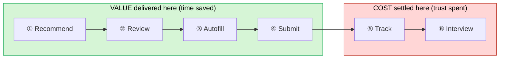
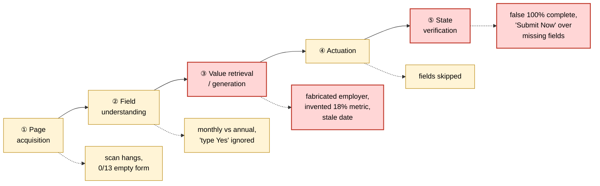

# Teardown: Jobright.ai

> Status: Living analysis, maintained · Started 2026-07-07
> My context: paying Turbo user, 350+ applications submitted through and alongside it. This teardown is based on logged daily usage, not a demo tour.

## TL;DR

Jobright is an AI job-search agent I pay for and use every day. It is genuinely fast, which is why I pay. But across 350+ real applications I logged 20+ documented failures where the agent misrepresented me: a fabricated employer, an invented "18%" resume metric, a $6,500,095,000 salary expectation, and a status panel claiming "form complete, submit now" while the resume field sat empty.

**The core argument:** every one of these failures is invisible to the metric Jobright appears to optimize, applications sent. The application still goes out, the counter still increments, the dashboard looks healthy. The cost lands weeks later in an interview, where no product dashboard is looking. Value is front-loaded at apply-time; cost is back-loaded at interview-time.

**What I would change:** replace the north star. Move from raw applications sent to **Trusted Qualified Applications (TQA)**: submitted successfully, matching the user's hard constraints, every critical fact traceable to the user's real profile, every resume change explainable in an interview. Each condition has a system-measurable proxy, so trust becomes something you can steer, not just hope for.

**Why it matters commercially:** the product's entire value is trusted delegation. The day a user must re-verify every field the agent touched, the time savings evaporate and so does the subscription. For a subscription business, trust bugs are revenue bugs.

**Highest-severity fix (my P0):** critical identity facts (employer, education, work authorization, salary) are *read, never generated*. When the agent is unsure, it stops and asks. This touches a small fraction of fields but removes the failure class that makes paying users quit.

## 1. Product overview

Jobright.ai is an AI job-search copilot. Its core user is **the active job seeker who applies at volume across many sites, but still cares about application quality and personal truthfulness.** Three segments, with different stakes:

| Segment | Core need | Why they use Jobright |
|---|---|---|
| **Volume-first applicants** | Apply to more jobs, faster | New grads, laid-off workers, career changers, need to kill repetitive form-filling |
| **Quality-first applicants** | Every application must sound like *them* | PM / design / engineering professionals, cannot afford obviously-AI copy or fabricated claims |
| **Constraint-heavy applicants** | Cannot apply wrong, cannot fill wrong | People with visa, salary, location, or work-authorization constraints, one wrong field is disqualifying |

The in-product H1B-sponsor filter reveals how central the third segment is to its real user base.

## 2. Business model

Consumer side is **freemium SaaS**: the free tier delivers matching and basic tools; **Turbo** puts the high-frequency, high-value, execution-heavy capabilities behind a subscription: the full agent, tailored materials, auto-apply, and connection resources. There is also an employer-side recruiting product, so the long-term shape is likely **B2C subscription + B2B recruiting (two-sided)**, but Turbo itself sells *efficiency and outcomes to job seekers*.

**Why I personally paid (the willingness-to-pay moment):** agent mode. Match scoring against my resume (93% / 80% / 72%), JD-tailored resume versions, and raw speed. The time that used to produce ~15 applications now produces 30+. Some submissions complete without me watching. New postings surface within hours. Generated answers handle the time-sink questions (why company, why fit, tell me about a time you...).

**The churn thesis (why the failures below are existential, not cosmetic):** the product's entire value is *trusted delegation*. The moment a user must re-verify every school name, referral answer, salary field, free-text answer, and resume edit, **the time saved by automation is eaten by verification**, and the willingness to keep paying collapses. For a subscription business, trust bugs are revenue bugs.

## 3. Core user journey

My journey as a paying Turbo user, stage by stage, where each stage delivers the value I pay for, and where it quietly hurts.

**① Recommendations.** *Value:* one feed of plausibly matching jobs, replacing hours of searching across LinkedIn, company sites, and job boards. *Hurt:* "looks relevant" isn't the bar. Logged precision on my hard constraints was ~43%: internships for a full-time profile, an OCaml engineering role at "100% skills match," a "W-2 candidates only" posting served to a future-sponsorship user. It saves search time while it erodes my trust in the feed. I've started suspecting the match score is largely keyword-driven (untested hypothesis, worth probing).

**② Reviewing a job (the match %).** *Value:* triage at volume. At 30+ applications a day, the percentage lets me sequence: the 80% match before the 60%. *Hurt:* the score can mask hard-constraint violations. A "90% match" that fails on sponsorship, salary, seniority, or employment type is worse than no score, because it misleads exactly at the moment I'm using it to decide.

**③ Autofill / agent application.** *Value:* the core reason I pay for Turbo. It kills repetitive form-filling, drafts answers, tailors the resume per JD (which genuinely helps pass ATS screens), and turns manual applying into a high-throughput workflow. *Hurt:* this is the most dangerous stage. The problem is not that it's slow. It's that it is **confidently wrong**: a $6.5B salary expectation, a fabricated employer, an invented "18%" metric, stale dates, a mishandled 'type Yes' instruction. Fabricated numbers on my resume are answers I cannot give in an interview. And on non-partnered sites, "autofill" often degrades into endless scanning that costs more time than it saves.

**④ Submit.** *Value:* speed at the moment it matters. Postings close fast, and being early is real edge; if anything, I want this step *faster*. *Hurt:* **the submit button is the trust boundary.** Before it, an error is a draft problem. After it, the error is me. A false "100% complete" or an auto-submit I couldn't intercept converts a fixable mistake into a sent application carrying my name.

**⑤ Tracking.** *Value:* at my volume, memory is impossible. I need to know which company, which resume version, which answers, what status. *Update (2026-07-12):* the Applied tab now links each application to the company and the resume version used, a genuine improvement, credit where due. *Hurt:* traceability doesn't neutralize fabrication. A logged fabricated resume is still a resume I have to defend live. And the record remains partial: no diff or rationale for what was changed, and (unverified) no archive of the free-text answers submitted for me.

**⑥ Interview.** *Value:* the funnel's real end. An application is worth something only if it produces an interview I can walk into with confidence. A good agent should let me know exactly **what story it told about me, what image of me it built**. *Hurt:* the "profit analysis" episode, a tailored rewrite I couldn't explain when an interviewer asked. The cost of stage-③ fabrication isn't charged at submission; it settles here, weeks later.

**The structural read:** value is front-loaded (①–④, where my time is saved); cost is back-loaded (④–⑥, where my trust is settled). The product books its win at submission; the user discovers the loss weeks later.

Submit (④) sits in both zones: it is the last moment the product creates value and the first moment it can cost the user. That overlap is the trust boundary, and it is the same attribution gap that lets an "applications sent" north star look healthy while trust erodes (§5).

## 4. Metrics analysis

**I would not use raw "Applications Sent" as the north star.** It is trivially gameable, and it rewards the wrong behavior, every one of these counts as a "sent application":

- an application with a fabricated referral answer
- an annual salary figure filled into a monthly-pay field
- a resume rewritten so far the user can't explain it in an interview
- a stuck AI scan the user retries (may even count as activity)
- a LinkedIn Easy Apply submission that never carried the tailored resume

Optimizing it turns the product into a **high-throughput spam engine**.

### Proposed north star: Weekly Trusted Qualified Applications (TQA)

An application counts toward TQA only if **all four** hold:

1. **Qualified**, meets the user's hard constraints: location, work authorization, visa, salary floor, role type, seniority.
2. **Factually correct**, critical fields (school, employment, referral, salary, work authorization) come from the user's canonical profile, rules, or explicit confirmation. Never model-guessed.
3. **Submission succeeded**, actually submitted; not mid-scan, stuck, or partially filled.
4. **Interview-ready**, the resume, cover letter, and free-text answers are traceable; the user can explain every change in an interview.

### Why TQA beats raw volume for every segment

| Segment | Problem with raw Applications Sent | Why TQA is better |
|---|---|---|
| Volume-first | Reflects speed but rewards junk applications | Keeps the speed, filters low-match jobs |
| Quality-first | Mass AI copy and fabricated rewrites damage personal brand | Requires authentic, explainable, traceable materials |
| Constraint-heavy | Mis-filled visa/salary/referral is catastrophic | Enforces critical-field accuracy and hard-constraint filters |

### Outcome metrics (guardrails, not the north star)

Interviews per 100 TQAs · recruiter response rate · offer rate · retention / Turbo renewal. These are the real results, but they lag by weeks and are confounded by market conditions, candidate background, and hiring cycles. They validate the north star; they can't steer weekly product decisions.

### Making TQA measurable at scale

"Trusted Qualified Applications" should be operationalized through observable system signals rather than treated as a vague quality concept.

**Qualified**, this should *not* be measured as "hard-constraint pass rate," because passing saved constraints is part of the definition itself. The key quality metrics measure failure instead, and belong to the **recommendation stage**:
- *Constraint violation rate*: % of recommended or submitted roles that violate user-saved hard constraints (work authorization, location, salary floor, seniority, job type, sponsorship).
- *Post-recommendation rejection rate*: % of recommended jobs the user dismisses because they violate a saved requirement.

**Factually grounded**, critical fields (education, employment history, referral status, work authorization, salary expectations) come from a canonical profile, saved user policy, or explicit confirmation:
- *Critical-field provenance coverage*: % of high-risk fields populated from a canonical profile, saved rule, or explicit confirmation.
- *Critical-field correction rate*: % of high-risk autofilled fields later corrected by the user.
- *Salary-context conflict rate*: % of applications where entered compensation conflicts with the job's stated range, compensation unit, or saved user rule.
- *Low-confidence escalation rate*: % of uncertain high-risk fields surfaced to the user rather than auto-submitted.

**Successfully submitted:**
- *Verified submission completion rate*: % of application flows with a confirmed submission state.
- *Unsupported-site completion rate*: completion rate for AI Scan / non-partnered ATS flows.
- *p50 / p90 time to completion*: especially for unsupported sites, where long scan time is a major failure mode.

**Interview-ready:**
- *Application-to-resume-version linkage rate*: % of submitted applications linked to the exact resume version used.
- *Material resume-diff acknowledgment rate*: % of high-impact resume edits reviewed or pre-approved by the user.
- *High-impact answer provenance rate*: % of generated behavioral answers or cover-letter claims linked to a user-provided project, metric, or evidence-bank entry.

These do not perfectly measure trust. But they make trust measurable enough to improve systematically.

## 5. Diagnosis, seven failure modes, five system gaps

The failure modes I logged are concrete and memorable on their own, but they point to five underlying system-level product gaps:

| # | Observed problem | Failure mode |
|---|---|---|
| 1 | Wrong school name; fabricated referral ("Yes" + invented company) | **Critical fact accuracy failure** |
| 2 | Salary reuses last-typed number; annual figure in monthly fields; ignores JD range | **Context-aware field interpretation failure** |
| 3 | AI scan on non-partnered ATS hangs long, often fills nothing | **Cross-site execution reliability failure** |
| 4 | Answers & cover letters read obviously AI-generated | **Voice + evidence grounding failure** |
| 5 | Agent silently rewrites resume; user can't explain it in interviews | **Change traceability / interview-readiness failure** |
| 6 | LinkedIn Easy Apply jobs included without the tailored resume | **Channel coverage / asset handoff failure** |
| 7 | Agent reports "5/5 filled, form complete, Submit Now" while the ATS flags missing required fields (email, phone, even the resume itself); "100%" shown over visibly empty fields | **Execution-state misreporting failure** |

### The five underlying system gaps

| System gap | Covers | What the product needs |
|---|---|---|
| **1 · Canonical profile & policy engine** | #1 wrong facts, #2 salary misuse | A canonical source of truth plus explicit user policies for high-risk fields |
| **2 · Cross-site execution & asset routing** | #3 AI-scan failures, #6 Easy Apply handoff | Reliable fallback states, clear execution visibility, channel-aware resume handoff |
| **3 · Evidence-grounded content generation** | #4 AIGC-sounding answers | An evidence bank, user voice controls, generation tied to real experiences |
| **4 · Resume versioning & change traceability** | #5 unexplainable rewrites | Per-application resume history, visible diffs with reasons, an interview-prep view |
| **5 · Execution-state integrity** | #7 false completion claims | Field state verified against the ATS's own validation (never self-reported); submit gates that block on verified state, not on the agent's belief |

Why gap 5 is distinct from gap 2: a hang or an unsupported site (#3) is a *visible* failure the user can take over from. A **false success claim** actively invites submitting an incomplete application. It doesn't just fail to deliver value; it weaponizes the user's trust in the status UI. Observed compound case: the agent auto-submits tailored (sometimes fabricated) resumes before the user can intervene, and the user, at 30+ applications/day, cannot reconstruct from memory which version went where. _(Verified 2026-07-12, partially: the Applied tab now links each application to company + resume version. Still missing/unverified: change diffs with rationale, archived free-text answers, and any pre-submit confirmation gate, the critique is scoped to those.)_

### Failure attribution across the agent pipeline, why "better parsing" won't save it

The intuitive diagnosis for a form-filling agent that fills things wrong is *"it can't read the page"*: bad parsing, weak OCR. That diagnosis is mostly wrong here, and the way to see it is to attribute every logged incident to a stage of the agent's pipeline:

The two red stages carry the highest-severity failures, and neither is a parsing problem. ① is DOM access for web ATS forms (OCR/CV only enters for PDF or image forms). ③ is the decision *"does this value come from the user's profile, or does a model generate it?"* ⑤ is whether the agent tells the truth about what it just did.

| Stage | What it does | Logged evidence living there |
|---|---|---|
| ① Page acquisition | Get the form's structure (DOM, dynamic JS, iframes) | AI-scan hangs; "0/13" over an empty form; "Autofill Not Supported" |
| ② Field understanding | What does this field mean? | Annual figure in monthly field; 'If "Yes", type Yes' instruction ignored |
| ③ Value retrieval / generation | Where does the value come from? | **Fabricated employer (BCG); invented degree name; invented "18%" resume metric; stale past date; blind salary reuse** |
| ④ Actuation | Actually write values, click buttons | Fields skipped while flow proceeds |
| ⑤ State verification | Confirm what was actually written/submitted | **All of failure mode #7** (false "100%", "Submit Now" over missing required fields) |

Two conclusions fall out of the attribution:

1. **Perfect parsing would not prevent the worst failures.** The highest-stakes incidents (fabricated employer, invented metrics, stale answers) live in stage ③: the system *generates* where it should *retrieve*. That is a policy decision, not a perception limitation, and it is exactly what P0 ("read, never generated") fixes. Investing in better page understanding (①–②) buys coverage of the long tail of ATS sites; it buys zero trust on the sites that already work.
2. **Stage ⑤ decides whether the user can even see stages ①–④ fail.** A parsing error under honest state reporting is an inconvenience; a parsing error under false "100% complete" claims becomes a submitted, wrong application. Gap 5 is load-bearing for the entire pipeline.

Method note: this is the same fault-attribution discipline used in LLM eval work. Attribute failures to pipeline stages *before* deciding where to invest. Two questions classify almost every incident: *did the system understand the field?* and *was the value retrieved or generated?*

**Root cause:** every one of these is *cheap* under an "Applications Sent" north star. The application still goes out, the counter still increments. Under TQA, every one of them subtracts. The metric explains the pattern.

### Steelman: why "Applications Sent" can remain rational for longer than it should

I think Jobright's current focus on applications sent is understandable.

In an early growth stage, "applications sent" is immediate, visible, and easy for users to understand. It clearly communicates the Turbo value proposition: save time, reduce repetitive work, and apply to more relevant jobs. It is also easy to instrument, easy to demonstrate in a product demo, and aligned with a market where competing AI job tools are heavily competing on speed and automation.

Trust, factual accuracy, and interview readiness are less visible in the first-session experience. Adding confirmation steps for salary, referral status, resume edits, or free-text answers can introduce friction and reduce short-term completion rates. If I were on the team, I might initially make the same tradeoff.

**There is also an attribution problem.** Many trust failures do not surface at the moment of submission. A wrong salary expectation, referral answer, work-authorization response, or unfamiliar resume edit may create problems days or weeks later, during recruiter screening, interview preparation, or renewal decisions. The user may silently correct the information, blame themselves, blame the employer's application flow, or simply stop using the product later. As a result, Jobright's core dashboards may record a successful application while missing the downstream trust cost. The product can look healthy on immediate throughput metrics even when it is gradually weakening user confidence.

So the issue is not that optimizing for applications sent was irrational. The issue is that the metric becomes incomplete once Jobright is representing users in high-stakes decisions.

> Volume is primarily an acquisition logic. Trust is primarily a retention logic.

When Turbo renewal and repeat usage become the binding growth constraint, maximizing raw applications sent without improving trust becomes increasingly irrational. At that point, the product should still optimize for speed, but shift from maximizing raw applications sent to maximizing **trusted qualified applications submitted**. The goal is not to add manual review everywhere. It is to automate low-risk tasks aggressively while escalating only high-risk or low-confidence decisions.

## 6. Recommendations (prioritized)

**P0, Critical profile facts.** Referral, work authorization, visa, education, employment, salary: these fields are **read, never generated**, sourced from the canonical profile, user rules, or explicit confirmation. When uncertain, the agent stops and asks. "Guess something reasonable" is not permitted for identity-level facts.

**P1, Salary intelligence.** Parse the JD's posted pay range per job. Detect annual / monthly / hourly. Let the user set rules: "if the JD range is explicit, default to the midpoint"; "never apply below $X"; "prefer a range over a single number when asked for expected salary." Never blind-reuse the last-typed figure.

**P1, Resume diff + application memory.** *(Partially shipped as of Jul 2026: the Applied tab links each application to company + resume version, credit where due.)* What's still missing: every JD-tailoring produces a **diff** (what changed, why, old bullet / new bullet, matching JD keyword); the free-text answers are archived alongside; and a materially rewritten resume cannot be auto-submitted without confirmation or a saved approval rule. The bar stays the same, one click before an interview: *"this is exactly what was submitted on my behalf, and why."* **And a hard gate: no tailored resume is auto-submitted without either an explicit diff confirmation or a previously saved user approval rule**, observed today, the agent submits fabricated versions faster than the user can intervene.

**P2, Grounded writing.** Stop letting the model free-write "why are you a good fit." Build a user **evidence bank**, projects, metrics, stories, leadership/teamwork examples, preferred tone. Every generated answer cites which real experiences it used. No evidence → ask the user, don't invent.

**P2, Execution reliability + honest state.** For non-partnered ATS sites, classify before acting: full adapter / partial autofill / AI scan / unsupported. Show explicit status, expected steps, and a fallback. *"This site fills to ~60%; please confirm the rest"* beats an infinite loading state that ends with nothing. And completion claims must derive from the **ATS's own validation state, never the agent's belief**, a status panel that says "5/5 filled, Submit Now" while the form flags a missing resume is worse than no status panel at all.

**P3, Expose the agent as an API / MCP server.** The trust rules above become enforceable when the product's core capabilities are exposed as typed tools rather than UI automation, an API cannot misreport state the way a status panel can:

| Tool | Contract | Which trust rule it enforces |
|---|---|---|
| `search_jobs(constraints)` | returns only roles passing the user's saved hard constraints, with match rationale | Qualified (funnel 1) |
| `draft_answer(question, jd)` | returns `{answer, sources[]}`, every claim cites a canonical-profile entry; no source, no answer | Factually grounded |
| `get_application_record(job_id)` | returns `{submitted_resume_version, answers[], submit_status, timestamp}` | Submission verified + interview-ready |

This also positions Jobright for the agent ecosystem: users' own AI assistants (Claude, etc.) could operate Jobright safely through the same contracts.

### Draft RICE prioritization (assumptions stated, to be recalibrated with usage data)

Scored as (Reach x Impact x Confidence) / Effort. Reach is share of Turbo users touched per month, Impact on the 0.25 to 3 scale, Confidence discounted where my evidence is n-of-1, Effort in rough person-months.

| Fix | R | I | C | E | Score | Reasoning in one line |
|---|---|---|---|---|---|---|
| P0 Read-never-generated for critical facts | 0.9 | 3.0 | 0.8 | 2 | **1.08** | Every user has critical fields; catastrophic-tail removal; incident-backed confidence; mostly policy plus plumbing |
| P2 Execution honesty (ATS-verified state) | 0.8 | 2.0 | 0.8 | 2 | **0.64** | False success claims invite bad submissions; verified against ATS validation, not agent belief |
| P1 Resume diff + confirmation gate | 0.6 | 2.0 | 0.7 | 2 | **0.42** | Partially shipped already; the gate is the missing half; confidence discounted for the same reason |
| P1 Salary intelligence | 0.5 | 1.0 | 0.8 | 1 | **0.40** | Narrower blast radius than identity facts, but cheap and every incident is user-visible |
| P2 Grounded writing (evidence bank) | 0.7 | 1.0 | 0.5 | 3 | **0.12** | Real value, but impact is diffuse and effort heavy; needs discovery on how users maintain a bank |
| P3 Agent-as-API / MCP server | 0.2 | 2.0 | 0.5 | 4 | **0.05** | Strategic, not urgent; reach starts small; sequenced after trust fundamentals hold |

The ranking confirms the priority labels assigned qualitatively, with one useful surprise: execution honesty scores nearly as high as the headline P0, because a truthful status panel protects users from every other failure class at once.

## 7. Competitive landscape: the delegation-trust spectrum

The job-application tool market sorts cleanly by one variable: **how much action the tool takes without a human in the loop.**

| Tool | Delegation depth | Trust posture | Market signal |
|---|---|---|---|
| **Teal** | Organize only: bookmark, track, rate; light autofill assist | User does everything that matters | 4.9 on the Chrome Web Store; loved as a control tool |
| **Simplify** | Autofill assistant: fills 100+ ATS forms, user reviews and clicks submit | Explicitly *not* an auto-apply bot; human owns the submit button | Free, ~90% field accuracy reported on modern ATSs; strong reputation |
| **Jobright** | Agentic: matches, tailors, fills, and can complete submission | Delegation sold as the premium (Turbo) value | Growing, paid; the failures documented in this teardown |
| **LazyApply** | Fully automated volume: hundreds of applications unattended | Volume first, accuracy afterthought | ~2.4 on Trustpilot, 52% one-star; complaints mirror this teardown's taxonomy: wrong work-authorization answers, half-filled forms, inflated counts |

Two readings of this table.

First, **external validation**: LazyApply's public reviews independently reproduce the failure classes I logged on Jobright (wrong answers on authorization questions, field mapping by name matching rather than meaning, submitted counts that flatter the tool rather than serve the user). These are not one product's bugs. They are what happens to any product in this category that optimizes throughput without a trust layer.

Second, **the strategic opening**: user sentiment currently *inverts* with delegation depth. The tools people love most are the ones that do the least. That is not evidence that delegation is a bad product; it is evidence that nobody has yet shipped trustworthy delegation. Jobright sits at the deepest delegation point of any credible player, which means it is positioned to own the entire category the moment it closes the trust gap, and TQA is the operating metric that would get it there. The prize is not "faster than Simplify." The prize is being the first agent users don't feel they have to check.

## 8. One-line product thesis

> Jobright's opportunity is not simply to help users apply faster. It is to become a job-search agent that users trust to represent them accurately when they are not watching.

## 9. If I were their PM: the first 90 days

Analysis is cheap; sequencing is the job. What I'd actually do with this, in order:

1. **Instrument before building.** Ship the measurement first: critical-field provenance coverage, critical-field correction rate, verified-submission rate. Right now the team likely cannot see these, which is why the failures stay invisible. You cannot move a number you do not log.
2. **Land the P0 (read, never generated) on the top five identity fields**: employer, education, work authorization, referral, salary. Scope it to partnered ATSs first, where execution is reliable, so the fix isn't confounded by parsing failures.
3. **Ship execution honesty in parallel**: completion state reads from the ATS's own validation, and the submit button blocks on verified state. This is the cheap fix that protects users from every other failure at once (it scored nearly as high as the P0 in RICE for exactly that reason).
4. **Prove it on the north star.** Watch weekly TQA and critical-field correction rate move before touching the lower-priority items. If correction rate doesn't fall, the P0 was scoped wrong, and I'd rather learn that in month two than month six.

The discipline this teardown demonstrates is the one I'd bring to the role: find the metric that explains the pattern, attribute failures to where they actually live, sequence fixes by impact over effort, and treat every claim as something that has to survive evidence.

## 10. Where this analysis could be wrong

A teardown that only argues its own case isn't analysis yet. Here is where I'd expect pushback, and how I'd de-risk each point before betting a roadmap on it.

- **Prevalence is unestablished (the biggest one).** Everything here is one heavy user's logged usage. I documented 20+ incidents but I cannot tell you whether critical-field errors happen on 2% of applications or 20%, and that number changes the entire priority calculus. *De-risk:* the two-funnel evidence plan in the evidence log, recommendation-stage constraint-violation rate, plus a daily random audit of 5 applications, turns incident documentation into a rate estimate. I'd want that before committing eng time, not after.
- **I'm inferring the north star, not confirming it.** "Jobright optimizes applications sent" is read off the product's behavior and incentives, not off their internal dashboards. They may already track trust metrics I can't see. *De-risk:* one conversation with the team replaces the inference. The failure *pattern* stands regardless; the *explanation* is a hypothesis.
- **The P0 could over-gate and damage the thing users pay for.** "Read, never generated; stop and ask when unsure" risks turning a fast agent into a slow one if "unsure" fires too often. If every third application pauses, I've traded a trust problem for a speed problem, and speed is the reason people subscribe. *De-risk:* ship it behind a confidence threshold to a small cohort, measure pause-rate and completion-rate, and tune the threshold before a wide release. The bar I set (pause under 5% of applications, resolve in under 10 seconds) is a hypothesis to be validated, not a guarantee.
- **My segment weighting is a personal bias.** I'm a constraint-heavy applicant (visa, salary floor), so I feel critical-field errors more sharply than a volume-first new grad might. A user who just wants 50 applications out the door may rationally prefer speed over the gate I'm proposing. *De-risk:* segment the TQA impact by user type before assuming the fix helps everyone equally; let risk tolerance be a user setting, not a global default.

None of these overturn the core finding: the failures are real, they cluster in value-generation and state-verification, and they're invisible to a volume metric. But the *sizing* and *sequencing* of the fix depend on numbers I'd insist on measuring first. Naming that is the difference between a confident critic and someone you'd trust with the roadmap.
